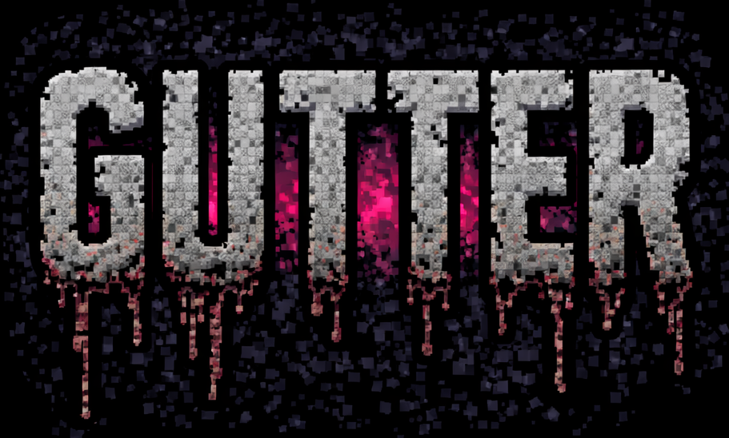

<p align="center">
  
</p>

**AI-native bullet journal** — Sequential logging, migration, collections, meeting prep. Local-first, privacy-first.

---

## Quick Start

```bash
# Prerequisites: bun (https://bun.sh), macOS recommended
git clone <repo-url>
cd gutter
bun install
cp .env.example .env    # edit with your config
bun run dev             # http://localhost:3000
```

---

## Features

- **Daily Log** — Sequential entries with five signifiers (task, appointment, note, memory, important)
- **Monthly Calendar** — Color-coded event grid synced from Apple Calendar
- **Day Detail** — Click any date for full event + entry view
- **Future Log** — Plan entries for upcoming months
- **Collections** — Topic-specific pages (Books, Goals, Notes, etc.)
- **Migration** — End-of-month review and task migration flow
- **Search** — Full-text search across all entries via OmniBar
- **Meeting Prep** — AI-powered prep notes pulling from Jira, Slack, and local memory
- **Transcript Upload** — Paste meeting transcripts, get AI summaries + action items
- **Natural Language Commands** — "buy milk tomorrow", "meeting at 3pm", "create a Books collection"
- **Voice Transcription** — Record audio, auto-transcribe via whisper.cpp
- **Calendar Events** — Commands create both journal entries and Apple Calendar events
- **Subtasks** — "Buy groceries: milk, eggs, bread" creates parent + children
- **PWA** — Installable, works offline
- **Single-user Auth** — Password-protected via HTTP-only cookie
- **Themes** — Cyberpink, Tokyo Night, Rose Pine

All AI runs locally via Ollama. No cloud APIs for content processing.

---

## Configuration

Copy `.env.example` to `.env` and configure:

### Required

| Variable | Description | Example |
|----------|-------------|---------|
| `AUTH_PASSWORD` | Login password (empty = auth disabled) | `my-secret-password` |
| `AUTH_SECRET` | Secret for session tokens | `change-this-to-something-random` |

### Calendars

| Variable | Description | Example |
|----------|-------------|---------|
| `CALENDARS` | Apple Calendar names to sync (comma-separated) | `Calendar,Family Calendar,Home,JW,School` |

### Ollama (AI features)

| Variable | Description | Default |
|----------|-------------|---------|
| `OLLAMA_URL` | Ollama server URL | `http://localhost:11434` |
| `OLLAMA_MODEL` | Model for meeting prep (needs tool calling) | `qwen3:latest` |
| `JOURNAL_COMMAND_MODEL` | Model for natural language commands | `qwen3:latest` |

### Meeting Prep Context (optional)

| Variable | Description | Example |
|----------|-------------|---------|
| `JIRA_URL` | Jira instance URL | `https://company.atlassian.net` |
| `JIRA_EMAIL` | Jira login email | `you@company.com` |
| `JIRA_API_TOKEN` | Jira API token | `your-api-token` |
| `SLACK_BOT_TOKEN` | Slack bot token | `xoxb-...` |
| `SLACK_CHANNELS` | Readable channels (pipe-delimited) | `C029BN2FBPD\|dev-chat,C027SHEDUET\|senior-devs` |

### Other

| Variable | Description | Default |
|----------|-------------|---------|
| `PORT` | Server port | `3000` |
| `HOST` | Server host | `localhost` |
| `DATABASE_PATH` | SQLite database path | `./gutter-journal.db` |
| `DEFAULT_THEME` | Default theme | `cyberpink` |
| `SESSION_MAX_AGE_DAYS` | Auth session duration | `30` |
| `WHISPER_MODEL_PATH` | Whisper model for voice | `~/.cache/whisper/ggml-base.en.bin` |
| `CALENDAR_ENABLED` | Enable Apple Calendar sync | `true` |

---

## Prerequisites

### Required
- **bun** — [bun.sh](https://bun.sh)
- **macOS** recommended (Apple Calendar integration uses `accli`)

### For AI Features
```bash
# Install Ollama + model
curl -fsSL https://ollama.com/install.sh | sh
ollama pull qwen3

# Verify
curl http://localhost:11434/api/tags
```

### For Voice Transcription
```bash
brew install whisper-cpp ffmpeg
mkdir -p ~/.cache/whisper
curl -L https://huggingface.co/ggerganov/whisper.cpp/resolve/main/ggml-base.en.bin \
  -o ~/.cache/whisper/ggml-base.en.bin
```

### For Calendar Integration (macOS)
```bash
npm install -g @joargp/accli
npx @joargp/accli calendars list   # verify
```

---

## Routes

| Route | Description |
|-------|-------------|
| `/` | Daily log (today's entries) |
| `/month` | Monthly calendar grid with events |
| `/day/YYYY-MM-DD` | Day detail (events + entries + meeting prep) |
| `/future` | Future log |
| `/collections` | Collection list |
| `/collections/:id` | Collection detail |
| `/migrate` | Migration review |
| `/login` | Login (when AUTH_PASSWORD is set) |

## API Routes

| Route | Method | Description |
|-------|--------|-------------|
| `/api/auth` | POST/DELETE | Login / logout |
| `/api/journal` | GET/POST | List/create entries |
| `/api/journal/:id` | PATCH/DELETE | Update/delete entry |
| `/api/journal/search` | GET | Full-text search (`?q=...`) |
| `/api/journal/command` | POST | Natural language command interpreter |
| `/api/journal/unresolved` | GET | Open tasks for migration |
| `/api/journal/migrate` | POST | Migrate entries to new date |
| `/api/journal/transcribe` | POST | Voice transcription |
| `/api/calendar` | GET | Upcoming calendar events |
| `/api/calendar/events` | GET | Events for month view |
| `/api/meeting-prep` | GET | All meetings with prep data |
| `/api/meeting-prep/prepare` | POST | Request AI prep for a meeting |
| `/api/meeting-prep/transcript` | POST | Upload meeting transcript |
| `/api/meeting-prep/update` | POST | Update prep notes externally |
| `/api/collections` | GET/POST | List/create collections |
| `/api/future-log` | GET/POST | List/create future log entries |
| `/api/projects` | GET/POST/DELETE | Manage projects |

---

## Meeting Prep

Meeting prep uses Ollama with tool calling to gather context:

1. Click **Prep me** on any meeting in the day view
2. Ollama searches Jira tickets, Slack channels, and local daily notes
3. Generates markdown prep notes with context, discussion points, and action items
4. Notes appear on the meeting card

Requires `JIRA_*` and/or `SLACK_*` env vars configured. Without them, prep will be based on local notes only.

### Recurring Meetings

Prep is scoped to individual occurrences using `event_id + occurrence_date`. Prep for Monday's standup won't show on Tuesday's.

---

## Stack

- **Framework:** Next.js 16, React 19
- **Styling:** Tailwind CSS, shadcn/ui
- **Database:** SQLite via better-sqlite3 (two DBs: `gutter.db` for app data, `gutter-journal.db` for journal entries)
- **State:** Redux Toolkit + RTK Query
- **AI:** Ollama (local LLM), whisper.cpp (local STT)
- **Calendar:** Apple Calendar via accli CLI
- **Runtime:** bun

---

## Project Structure

```
gutter/
├── app/
│   ├── page.tsx              # Daily log (root)
│   ├── month/page.tsx        # Monthly calendar
│   ├── day/[date]/page.tsx   # Day detail
│   ├── future/page.tsx       # Future log
│   ├── collections/          # Collections pages
│   ├── migrate/page.tsx      # Migration review
│   ├── login/page.tsx        # Auth login
│   └── api/                  # API routes
├── components/
│   ├── journal/              # JournalHeader, EntryInput, EntryList, OmniBar, etc.
│   ├── meeting/              # MeetingDrawer
│   └── ui/                   # shadcn components
├── lib/
│   ├── env.ts                # Centralized env validation
│   ├── db.ts                 # Main database (gutter.db)
│   ├── journal-db.ts         # Journal database (gutter-journal.db)
│   ├── ollama-prep.ts        # Meeting prep with Ollama tool calling
│   ├── calendars.ts          # Shared calendar list from ENV
│   └── calendar.ts           # Calendar event creation
├── store/
│   └── api/                  # RTK Query API slices
├── middleware.ts              # Auth middleware
├── .env.example              # Example configuration
└── gutter.db                 # SQLite database (created on first run)
```

---

## Scripts

```bash
bun run dev       # Dev server with hot reload
bun run build     # Production build
bun run start     # Production server
```

---

## License

MIT
